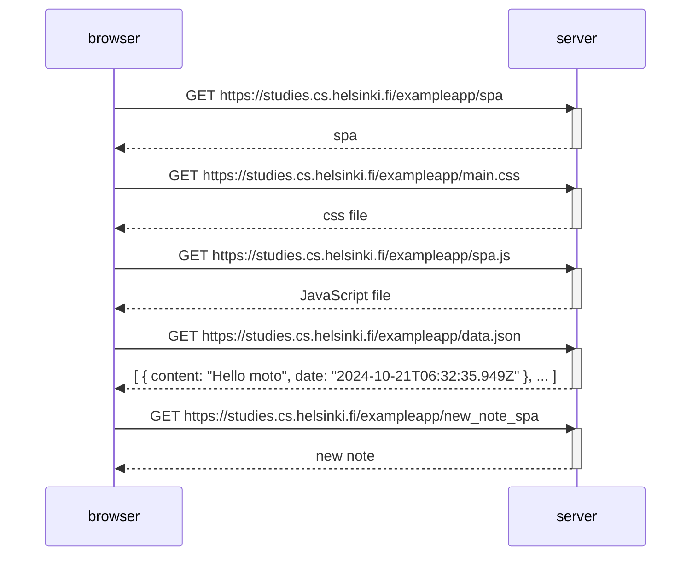

```mermaid
sequenceDiagram
    participant browser
    participant server

    browser->>server: GET https://studies.cs.helsinki.fi/exampleapp/spa
    activate server
    server-->>browser: spa
    deactivate server

    browser->>server: GET https://studies.cs.helsinki.fi/exampleapp/main.css
    activate server
    server-->>browser: css file
    deactivate server

    browser->>server: GET https://studies.cs.helsinki.fi/exampleapp/spa.js
    activate server
    server-->>browser: JavaScript file
    deactivate server

    browser->>server: GET https://studies.cs.helsinki.fi/exampleapp/data.json
    activate server
    server-->>browser: [ { content: "Hello moto", date: "2024-10-21T06:32:35.949Z" }, ... ]
    deactivate server  

     browser->>server: GET https://studies.cs.helsinki.fi/exampleapp/new_note_spa
    activate server
    server-->>browser: new note
    deactivate server
```